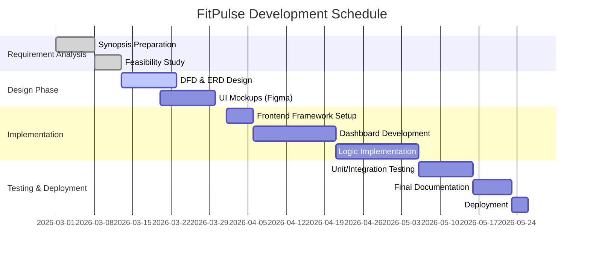
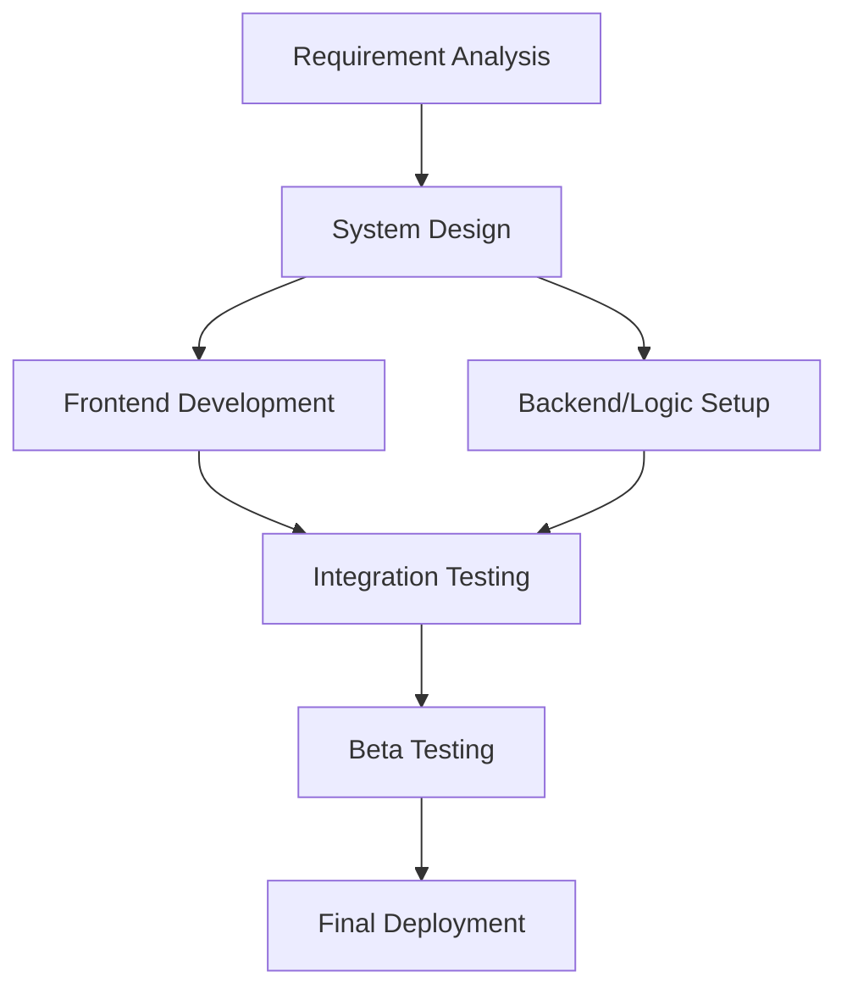

# Synopsis
## On
# “FitPulse: An Integrated Fitness & Health Management Platform”

**Submitted to the Uttaranchal University in partial fulfilment of the requirements for the award of the Degree of**
# BACHELOR OF COMPUTER APPLICATIONS

**Submitted by:**  
**Student Name:** [Your Name]  
**Learner ID:** [Your ID]

**Under the Guidance of:**  
**Guide Name with Designation:** [Guide Name]  
(Faculty Guide)

### UTTARANCHAL UNIVERSITY, DEHRADUN

---

# Table of Content

| S.no | Topic | Page No |
| :--- | :--- | :---: |
| 1 | Introduction and Objectives of the Project | 3 |
| 2 | Tools/Platform, Hardware and Software Requirement specifications | 4 |
| 3 | Problem Definition, Requirement Specifications, Project Planning and Scheduling (Gantt and PERT chart) | 6 |
| 4 | Analysis (Data Models: DFDs, ER Diagrams, Class Diagrams) | 9 |
| 5 | Complete structure (Modules, Data Structures, Process Logic, Reports) | 12 |
| 6 | Proposed security mechanisms at various levels | 15 |
| 7 | Future scope and further enhancement of the project | 16 |
| 8 | Bibliography | 17 |

---

# 1. Introduction and Objectives of the Project

## 1.1 Introduction
In the contemporary era of digitalization, health conscious individuals are increasingly seeking efficient ways to manage their fitness journeys. "FitPulse" is a comprehensive, web-based platform designed to bridge the gap between complex health data and user-friendly actionable insights. 

The application serves as a centralized hub for managing daily workouts, dietary intake, and physiological metrics like BMI. Unlike generic health apps, FitPulse focuses on a "Privacy First" and "User-Centric" design approach, offering custom roadmaps (4, 8, and 12-week plans) tailored to specific goals like muscle gain, weight loss, or maintenance. By integrating modern web technologies, it provides a seamless and interactive experience that motivates users to adhere to their fitness routines.

## 1.2 Objectives of the Project
The primary objectives of the "FitPulse" system are:
1. **Interactive Dashboarding:** To provide a real-time, high-performance dashboard that visualizes fitness progress via interactive charts and progress bars.
2. **Dynamic Nutrition Management:** To implement a smart dietary system with "Veg/Non-Veg" toggles and master-detail layouts for granular meal tracking.
3. **Automated Health Calculations:** To automate the calculation of vitals such as BMI and provide immediate, personalized health category feedback.
4. **Structured Roadmap Implementation:** To offer users a guided path through selectable durations and goals, reducing the cognitive load of planning workouts.
5. **Modern UI/UX Standards:** To leverage cutting-edge design principles like glassmorphism and micro-animations to improve user retention and satisfaction.

---

# 2. Tools/Platform, Hardware and Software Requirement specifications

## 2.1 Hardware Requirements
For the optimal execution and development of the FitPulse platform, the following hardware specifications are recommended:

### 2.1.1 Development Environment
- **Processor:** Intel Core i5 (10th Gen or higher) or AMD Ryzen 5.
- **RAM:** 8 GB DDR4 (16 GB for smoother multitasking).
- **Storage:** 256 GB SSD (Solid State Drive) for fast file indexing and build times.
- **Internet:** High-speed broadband for dependency installation (npm/yarn).

### 2.1.2 Client Environment
- **Device:** Any smartphone, tablet, or PC with a modern browser.
- **RAM:** Minimum 2 GB.
- **Display:** Responsive design supports everything from 360px (mobile) to 4K (desktop).

## 2.2 Software Requirements
The project follows a modern full-stack architecture using the following stack:

- **Operating System:** Windows 10/11 or macOS (Unix-based environment preferred for development).
- **Frontend Framework:** React.js with Vite (for lightning-fast build cycles).
- **Programming Language:** TypeScript (ensures type safety and reduces runtime bugs).
- **Styling:** Vanilla CSS3 with CSS Modules or Tailwind CSS for responsive layouts.
- **State Management:** React Context API or Redux for handling global user states.
- **Database:** Firebase Firestore (NoSQL cloud database).
- **Tools:** Visual Studio Code (IDE), Git (Version Control), Chrome DevTools (Debugging).

---

# 3. Problem Definition, Requirement Specifications, Project Planning and Scheduling

## 3.1 Problem Definition
Many existing fitness applications suffer from "Feature Overload" or "Static Content." Users often find it difficult to navigate through cluttered interfaces just to perform simple tasks like checking their BMI or finding a meal plan. Additionally, most free applications do not offer structured periodization (planning over weeks), leaving users without a clear path to their goal. FitPulse identifies this lack of structure and intuitive design as the core problem and solves it through a streamlined, module-based architecture.

## 3.2 Requirement Specifications

### 3.2.1 Functional Requirements
- **FR1: User Authentication:** Secure sign-up/login with session persistence.
- **FR2: BMI Processing:** Input height/weight; output BMI value and category.
- **FR3: Goal Setting:** Ability to select between "Weight Loss," "Bulking," and "Maintenance."
- **FR4: Content Filtering:** Toggle dietary plans based on preference (Vegetarian/Non-Vegetarian).

### 3.2.2 Technical Specifications
- **SPA Architecture:** Ensures no page reloads, providing a desktop-app feel.
- **Responsive Web Design (RWD):** Flexbox and Grid based layouts for cross-device compatibility.
- **JSON-based Data Flow:** Efficient communication between frontend and backend.

## 3.3 Project Planning and Scheduling

### 3.3.1 Gantt Chart

### 3.3.2 PERT Chart

---

# 4. Analysis

## 4.1 Data Models (Data Flow Diagrams)

### 4.1.1 Level 0 DFD (Context Diagram)
\`\`\`mermaid
flowchart LR
    User([User]) -- "Auth Credentials, Physiological Data" --> System[FitPulse System]
    System -- "Personalized Dashboard, Diet Plans, BMI Category" --> User
\`\`\`

### 4.1.2 Level 1 DFD
\`\`\`mermaid
flowchart TD
    User([User]) -->|Login Info| P1(1.0 Authentication)
    P1 -->|Auth Token| D1[(User DB)]
    User -->|Vitals| P2(2.0 Health Statistics)
    P2 -->|BMI & Classification| D1
    User -->|Preferences| P3(3.0 Dietary Management)
    D2[(Content DB)] -->|Menu Data| P3
    P3 -->|Veg/Non-Veg Plans| User
\`\`\`

---

## 4.2 Entity Relationship (ER) Diagram
\`\`\`mermaid
erDiagram
    USER {
        string userID PK
        string email
        float height
        float weight
    }
    GOAL {
        string goalID PK
        string type
        int duration_weeks
    }
    TRAINING_LOG {
        string logID PK
        date date
        string exercise_name
    }

    USER ||--o{ GOAL : "targets"
    USER ||--o{ TRAINING_LOG : "records"
\`\`\`

---

# 5. Complete Structure

## 5.1 Modules and Student Effort Estimation
The project is divided into five core modules. Total development effort is estimated at **180 hours**.

1.  **Auth Module (25 hrs):** Implementation of registration, login modals, and session management using localStorage/State.
2.  **Dashboard Module (40 hrs):** Creating the primary UI hub with responsive sidebars, summary cards, and progress charts.
3.  **Calculator Module (30 hrs):** Implementing the logic for BMI and categorization including interactive input forms.
4.  **Nutrition Module (45 hrs):** Managing the master-detail dietary layout with veg/non-veg filtering capabilities.
5.  **Roadmap Module (40 hrs):** Translating duration selections (4, 8, 12 weeks) into visual progression timelines.

## 5.2 Data Structures
- **User State (JSON):** Contains profile details, current BMI, and active goal ID.
- **Dietary Dictionary:** Key-value pairs mapping BMI categories to recommended meal templates.
- **Roadmap Array:** Chronological collection of workout tasks for each day of the selected duration.

## 5.3 Process Logic
- **BMI Calculation:** `BMI = Weight(kg) / (Height(m) * Height(m))`. Logic includes range validation and categorization (Underweight, Normal, Overweight, Obese).
- **Diet Filter:** A conditional rendering logic that selects objects from the `dietPlans` array based on the `isVegetarian` state toggle.

## 5.4 Likely Reports
1.  **Monthly Health Summary:** A PDF/Image report showing progress in BMI and overall weight consistency.
2.  **Workout Adherence Log:** A weekly report listing completed vs. skipped training sessions.

---

# 6. Proposed Security Mechanisms

1.  **Validation Layer:** All user inputs (height, weight, login) are sanitized on the frontend using controlled components and regex validation to prevent injection attacks.
2.  **Protected Routes:** Using React router guards to ensure only authorized users access the dashboard.
3.  **Data Encapsulation:** Critical logic for health calculations is abstracted into dedicated hooks, preventing unauthorized state manipulation.

---

# 7. Future Scope and Further Enhancement

1.  **Wearable Sync:** Integration with Apple HealthKit and Google Fit for auto-tracking steps and sleep.
2.  **AI Nutritionist:** Implementing an LLM-based chatbot that suggests recipes based on user’s remaining daily calories.
3.  **Community Modules:** Enabling "Fitness Circles" where users can share achievements and compete on leaderboards.

---

# 8. Bibliography

1.  *React Documentation* (https://react.dev) - Reference for component architecture and hooks.
2.  *MDN Web Docs* (https://developer.mozilla.org) - CSS Grid and Flexbox standards.
3.  Pressman, R. S. (2014). *Software Engineering: A Practitioner's Approach*.
4.  Vite Build Tool Official Docs (https://vitejs.dev).
